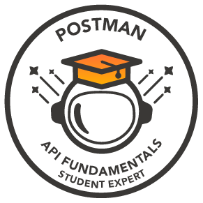

<h3 align="left">About Me: </h3>

ISTQB certified Senior QA Engineer with 6+ years experience in Web application and Mobile application testing with experience in QA methodologies, tools, processes and solid understanding on Agile software testing. I am passionate about continuous learning and improvement, and I seek to apply the best practices and methodologies in software quality engineering and agile development.

🚀<b>Specialization:</b> Manual, API, Performance, UI & Mobile Testing

🚀<b>Interests:</b> Automation, AI & Web Testing

 

  

<h3 align="left">Connect With Me: </h3>

 

<h3 align="left"> Languages and Tools:</h3>

            
 
          

 
<h3 align="left">Certifications:  </h3>

    
  

