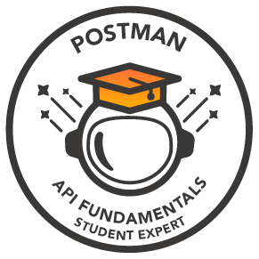

 
<h1 align="center">Hi there! I'm Dilini👋</h1>
<h3 align="center">Quality Assurance Expert</h3>

<h3 align="left">About Me:</h3>

ISTQB certified Senior QA Engineer with 6+ years experience in Web application and Mobile application testing with experience in QA methodologies, tools, processes and solid understanding on Agile software testing. I am passionate about continuous learning and improvement, and I seek to apply the best practices and methodologies in software quality engineering and agile development.

  

<h3 align="left">Connect With Me:</h3>

<h3 align="left">Skills:</h3>
<ul>
<li>Manual Testing (Web & Mobile)</li>
<li>Test Case Writing</li>
<li>Test Execution</li>
<li>Bug Tracking & Reporting</li>  
<li>QA Testing (Functional, Regression, Sanity, Compatibility, UAT, Localization)</li>
<li>Agile Methodologies</li>
</ul>

<h3 align="left">Technical Skills:</h3>
<ul>
<li><b>API Testing:</b> Postman</li>
<li><b>Performance Testing:</b> Apache JMeter</li>
<li><b>Monitoring Tools:</b> Grafana</li>
<li><b>Cloud Platforms & Tools:</b> Azure DevOps</li>    
<li><b>CI/CD Tools:</b> Jenkins, GitHub Actions</li>  
<li><b>Containerization Platform:</b> Docker</li> 
<li><b>Operating Systems:</b> Windows, iOS, Android</li> 
<li><b>Defect Management Tools:</b> JIRA, ClickUp</li>
<li><b>Test Management Tools:</b> TestRail, TestLink</li>
<li><b>SQL Databases:</b> MySQL</li>
<li><b>NoSQL Databases:</b> MongoDB</li>
<li><b>Version Control Tool:</b> GIT, GitHub </li>
<li><b>Cross Browser Testing Tool:</b> BrowserStack</li>
<li><b>Device Farms:</b> LambdaTest</li>
<li><b>Documentation Tools:</b> Microsoft Office, Google Docs, Confluence</li>
</ul>

     
  </a>

<h3 align="left">Examples of My Works:</h3>
<h4 align="left">Test cases writing</h4>
<li>Verbatim Website was used to create test cases.<a href="https://docs.google.com/spreadsheets/d/1YumHLafIHEAcXPCvran8QyOGCXueWHfb/edit#gid=658168019"> Check the Google Sheets document here</a></li>
<li>Meetao Mobile Application was used to create test cases.<a href="https://docs.google.com/spreadsheets/d/1Ze4a64eKFmpKj0ydI7bfQsQpQA4vwSn5/edit#gid=1495511660"> Check the Google Sheets document here</a></li>
