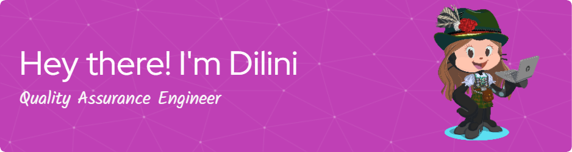
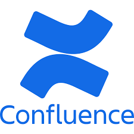
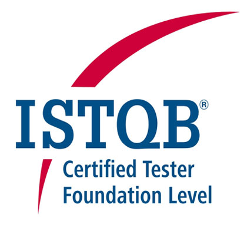

<h3 align="left">💫 About Me: </h3>

ISTQB-certified Senior QA Engineer with 7 years of experience in web and mobile application testing, specializing in delivering high-quality software through strong expertise in QA methodologies, tools, and Agile practices. Proven experience in Manual, API, UI, and Mobile with hands-on exposure to cloud-based application testing using AWS services such as S3, IAM, API Gateway, Lambda, and DynamoDB. I am passionate about continuous learning and improvement, and I seek to apply the best practices and methodologies in software quality engineering and agile development.

🚀<b>Specialization:</b> Manual, API, Mobile & Cloud-Based Testing (AWS)

🚀<b>Interests:</b> Test Automation, AI-Assisted Testing, Performance Testing

 

  

<h3 align="left"> Connect With Me: 

 
<h3 align="left">⚡ Tech Stack </h3>

  <!-- Row 1 -->
  
  
  
  
  

  <!-- Row 2 -->
  
  
  
  
  

<table>
  <tr>
    <td></td>
    <td></td>
    <td></td>
    <td></td>
    <td></td>
  </tr>
  <tr>
    <td></td>
    <td></td>
    <td></td>
    <td></td>
    <td></td>
  </tr>
</table>
 
<h3 align="left">🏆 Certifications: </h3>

    
  

