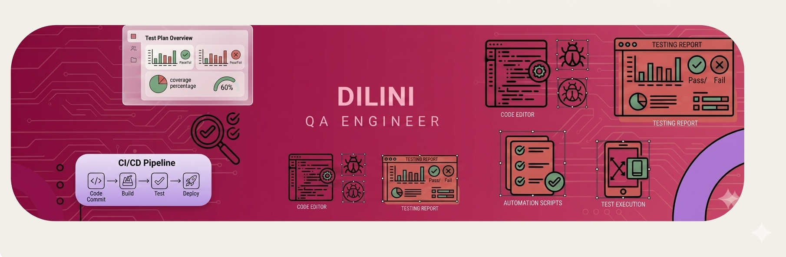
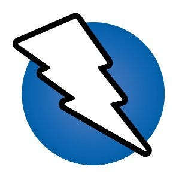
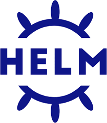

<h3 align="left">💫 About Me: </h3>

I'm a QA Engineer passionate about delivering high-quality software and exploring the future of AI-powered quality engineering.

Currently building **QA Launchpad** and **Solo Founder AI OS** while sharing my learning journey through GitHub, LinkedIn, and YouTube. My goal is to create practical resources, real-world QA projects, and AI testing case studies that help engineers and startups build better software.

🚀<b>Specialization:</b> Manual Testing, API Testing, Mobile & Cloud-Based Testing (AWS)

🚀<b>Interests:</b> Test Automation, AI-Assisted Testing, Performance Testing, Prompt Evaluation, Open Source
 
 
<h3 align="left">🚀 Currently Building </h3>

🏢 QA Launchpad

🧠 Solo Founder AI OS

🧪 AI Testing Portfolio

📺 QA Launchpad YouTube

✍️ Technical Content on LinkedIn

 
<h3 align="left">🌱 Currently Learning</h3>

AI Agent Systems

Prompt Evaluation

Response Evaluation

LLM Testing

Business Strategy

 

  

<h3 align="left"> 🔗Connect With Me: 

  

 
<h3 align="left">⚡ Tech Stack </h3>
<table>
  <tr>
    <td></td>
    <td></td>
    <td></td>    
    <td></td>
    <td></td>
    <td></td>
    <td></td>    
    <td></td>
    <td></td>
  </tr>
  <tr>        
    <td> </td>
    <td></td>
    <td></td>    
    <td></td>
    <td></td>    
    <td></td>
    <td></td>
    <td></td>
    <td></td>
  </tr>
</table>
 
<h3 align="left">🏆 Certifications: </h3>

    
  

 

